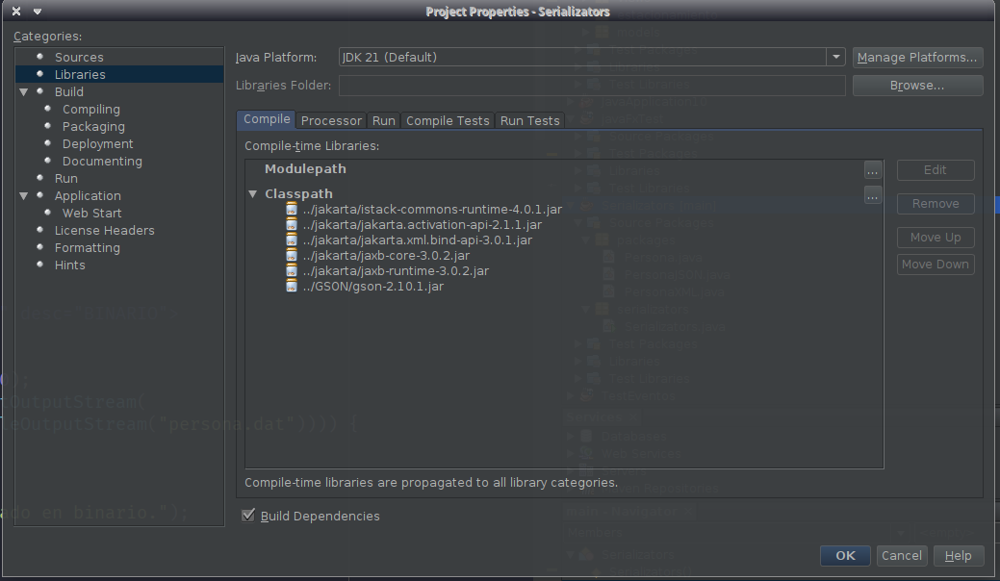

# java_serializators
Serializa y  parsea Binario Json y xml en Java.

## Cargar Librerías
En netbeans, click derecho en el proyecto > Properties > Libraries > Classpath > Add Jar/Folder > Agregar contenido(archivos JAR) de la carpeta [GSON](./GSON) y [Jakarta](./Jakarta)

